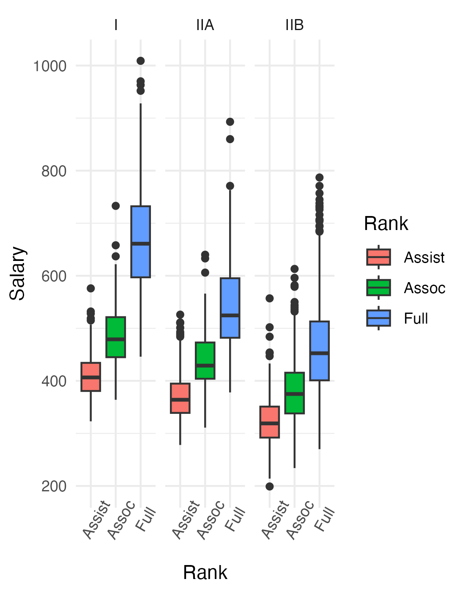
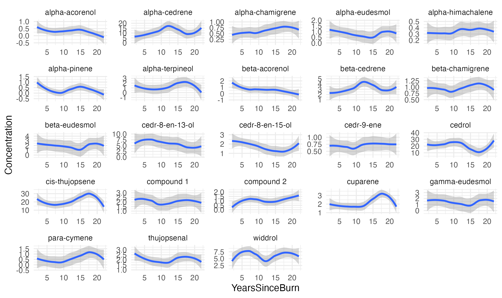

```{r setup, include=FALSE}
knitr::opts_chunk$set(echo = TRUE, warning=FALSE)
```
<br></br>
*The codes are included, but hidden. To view the code click the "show" button

# Tasks:
  
**1. Load and clean FacultySalaries_1995.csv file and Re-create the graph below...**

```{r echo=FALSE, fig.align='center',fig.width=5,fig.height=5}

```
<br></br>
I loaded all of the packages needed for the exam. I also loaded the FacultySalaries_1995.csv file
<br></br>
```{r, message=FALSE}
# Load packages
library(tidyverse)
library(modelr)
library(broom)

# Load the file
df <- read_csv("../../Data/FacultySalaries_1995.csv")
```
<br></br>
To clean the FacultySalaries_1995.csv file, I took the "AvgFullProfSalary", "AvgAssocProfSalary", and "AvgAssistProfSalary" columns and used the pivot longer function to create two new columns "Salary" and "Rank". With these columns, I created a new Data Frame along with "FedID", "UnivName", and "Tier" since I only needed to focus on salary for the graph. 
<br></br>
```{r, message=FALSE}
# Tidy the data. 
# Only need salary for the graph, so I will create a new df excluding the others
df_clean <- df %>% 
  select(c("FedID", "UnivName", "State", "Tier"), ends_with("Salary")) %>% 
  pivot_longer(ends_with("Salary"),
               names_to = "Rank",
               values_to = "Salary") %>% 
  mutate(Rank = case_when(Rank == "AvgFullProfSalary" ~ "Full",
                           Rank == "AvgAssocProfSalary" ~ "Assoc",
                           Rank == "AvgAssistProfSalary" ~ "Assist")) %>% 
  filter(Tier != "VIIB") # Remove VIIB from Tier since it doesn't show up in the example
```
<br></br>
My recreation of the given graph:
<br></br>
```{r, message=FALSE, fig.align='center',fig.width=5.5,fig.height=6.5}
# Re-create the graph
df_clean %>% 
  ggplot(aes(y=Salary, x = Rank, fill = Rank)) +
  geom_boxplot() +
  facet_wrap(~Tier) +
  theme_minimal()
```
<br></br>
**2. Build an ANOVA model and display the summary output in your report.**
<br></br>
```{r}
# anova model and summary
mod1 <- aov(data = df_clean, formula = Salary ~ State + Tier + Rank)
summary(mod1)
```
<br></br>
**3. Using the "Juniper_Oils.csv" data: Get it loaded, take a look, then tidy it!**
<br></br>
```{r, message=FALSE, results="hide"}
# Load the file
df2 <- read_csv("./Juniper_Oils.csv")

# Look at the structure of the data
str(df2)
```
<br></br>
To tidy the ""Juniper_Oils.csv" data, I took the columns of all of the chemicals and I used pivot_longer() to make them into two new columns "ChemicalID" and "Concentration"
<br></br>
```{r}
df2_clean <- df2 %>% 
  pivot_longer(cols = c("alpha-pinene","para-cymene","alpha-terpineol",
                       "cedr-9-ene","alpha-cedrene","beta-cedrene",
                       "cis-thujopsene","alpha-himachalene","beta-chamigrene",
                       "cuparene","compound 1","alpha-chamigrene","widdrol",
                       "cedrol","beta-acorenol","alpha-acorenol","gamma-eudesmol",
                       "beta-eudesmol","alpha-eudesmol","cedr-8-en-13-ol",
                       "cedr-8-en-15-ol","compound 2","thujopsenal"),
               names_to = "ChemicalID",
               values_to = "Concentration")
```
<br></br>
**4. Make me a graph of the following:**

        x = YearsSinceBurn
        y = Concentration
        facet = ChemicalID (use free y-axis scales)

**See the figure below for an idea of what I’m looking for:**
<br></br>
```{r echo=FALSE, fig.align='center',fig.width=5,fig.height=5}

```
<br></br>
My recreation of the graph:
<br></br>
```{r, fig.align='center',fig.width=9,fig.height=5, message=FALSE}
ggplot(df2_clean, aes(y=Concentration, x = YearsSinceBurn)) +
  geom_smooth() +
  facet_wrap(~ChemicalID, scales = "free") +
  theme_minimal()
```
<br></br>
**5. Use a generalized linear model to find which chemicals show concentrations that are significantly (significant, as in P < 0.05) affected by "Years Since Burn".**
```{r message=FALSE, results="hide"}
mod2 <- glm(data = df2_clean, formula = Concentration ~ YearsSinceBurn * ChemicalID)
summary(mod2)
```
Use the tidy() function from the broom R package in order to produce a data frame showing JUST the significant chemicals and their model output (coefficient estimates, p-values, etc)   

```{r}
# Show only the significant chemicals (P<0.05). 
# Use tidy() function from broom package.
tidy_mod <- tidy(mod2)

# Show only the significant chemicals (P<0.05). 
sig_chems <- tidy_mod %>% 
  filter(p.value < 0.05)
sig_chems
```
